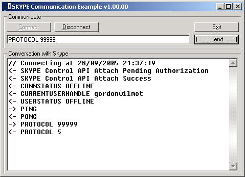



## Skype API Comminication Example

### Description

Demonstrates how to talk to the Skype API to develop application using Skype. The communication uses the windows messaging subsystem. You need to have Skype loaded. The same sample is available in C#.
 
### More Info
 
You need to have Skype Installed and running and you need the Skype API guide (there is a link to the documentation in the code)

             |
---                |---
**Submitted On**   |2005-09-13 21:50:12
**By**             |[Gordon Wilmot](https://github.com/Planet-Source-Code/PSCIndex/blob/master/ByAuthor/gordon-wilmot.md)
**Level**          |Intermediate
**User Rating**    |5.0 (30 globes from 6 users)
**Compatibility**  |VB 4\.0 \(16\-bit\), VB 5\.0, VB 6\.0
**Category**       |[Internet/ HTML](https://github.com/Planet-Source-Code/PSCIndex/blob/master/ByCategory/internet-html__1-34.md)
**World**          |[Visual Basic](https://github.com/Planet-Source-Code/PSCIndex/blob/master/ByWorld/visual-basic.md)
**Archive File**   |[Skype\_API\_1936049282005\.zip](https://github.com/Planet-Source-Code/gordon-wilmot-skype-api-comminication-example__1-62710/archive/master.zip)

